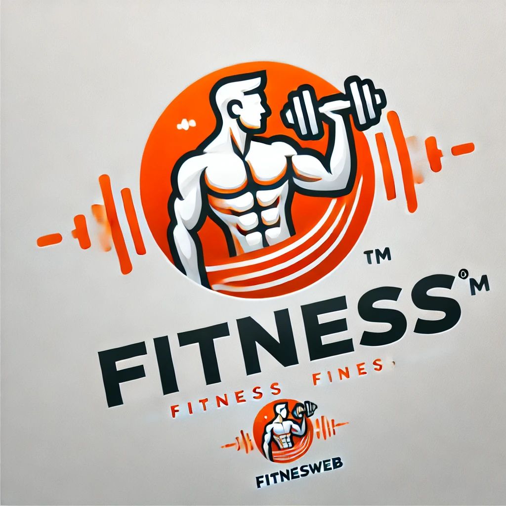

# FitnesWeb

<div align="center">
  
  <p><em>Seu guia completo para uma vida mais saudável e ativa</em></p>
</div>

## 📋 Sobre o Projeto

FitnesWeb é uma página web interativa desenvolvida com HTML, CSS e JavaScript, dedicada a promover hábitos saudáveis através de conteúdo sobre treino, corrida e alimentação. Nossa missão é tornar informações de qualidade sobre saúde e bem-estar acessíveis a todos, independentemente do nível de condicionamento físico ou conhecimento prévio.

## ✨ Funcionalidades

- **Dicas de Treino**: Rotinas de exercícios para diferentes níveis e objetivos
- **Guia de Corrida**: Planos de treino, técnicas e sugestões de percursos
- **Orientação Nutricional**: Receitas saudáveis e dicas de alimentação balanceada


## 🚀 Tecnologias Utilizadas

- HTML5
- CSS3
- JavaScript

## 🖥️ Pré-requisitos

Não há pré-requisitos especiais para visualizar o projeto - basta um navegador web moderno:
- Google Chrome
- Mozilla Firefox
- Safari
- Microsoft Edge

## 🔧 Instalação

```bash
# Clone este repositório
git clone https://github.com/Diego-Axel/FitnesWeb.git

# Acesse a pasta do projeto
cd FitnesWeb

# Abra o arquivo index.html no seu navegador
```

Ou simplesmente baixe os arquivos e abra o `index.html` em seu navegador favorito.

## 📱 Layout

O FitnesWeb possui um design intuitivo e responsivo, adaptando-se a diferentes tamanhos de tela e dispositivos. A interface foi desenvolvida pensando na experiência do usuário, com navegação simples e acesso rápido às informações mais relevantes.

## 👥 Contribuição

Contribuições são sempre bem-vindas! Para contribuir:

1. Faça um Fork do projeto
2. Crie uma Branch para sua Feature (`git checkout -b feature/AmazingFeature`)
3. Adicione suas mudanças (`git add .`)
4. Comite suas mudanças (`git commit -m 'Adicionando feature incrível'`)
5. Faça o Push para a Branch (`git push origin feature/AmazingFeature`)
6. Abra um Pull Request

## 📄 Licença

Este projeto está sob a licença MIT. Veja o arquivo [LICENSE](LICENSE) para mais detalhes.

## 📬 Desenvolvedor

Nome: Diêgo Axel

Link do Projeto: [Clique Aqui](https://github.com/Diego-Axel/FitnesWeb#)

---

<div align="center">
  <p>Desenvolvido para promover saúde e bem-estar</p>
</div>